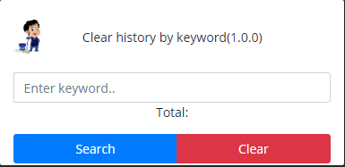

## Clean your search history

### How to use

1. Click on the extension, notice the popup with the "Enter keyword" input field. 
2. Enter a **keyword** to be located in your search history.
3. Click both the **Search** button and **Clear** button to clear the search history containing that **keyword**

## Screenshot

